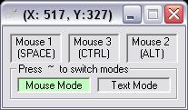



## \[A\+ Key Board Mouse\]

### Description

This is a key board controled mouse program, it used the arrow keys to move (you can go up, down, left, right, and all diagonal directions)to left click press space, to right click press alt, to middle click / mouse wheel click press ctrl.

this works very well. I hope you enjoy it!

please leave me feed back and vote, thx!

-LCSBSSRHXXX
 
### More Info
 

             |
---                |---
**Submitted On**   |2004-05-31 15:52:30
**By**             |[LCSBSSRHXXX](https://github.com/Planet-Source-Code/PSCIndex/blob/master/ByAuthor/lcsbssrhxxx.md)
**Level**          |Advanced
**User Rating**    |4.2 (25 globes from 6 users)
**Compatibility**  |VB 6\.0
**Category**       |[Miscellaneous](https://github.com/Planet-Source-Code/PSCIndex/blob/master/ByCategory/miscellaneous__1-1.md)
**World**          |[Visual Basic](https://github.com/Planet-Source-Code/PSCIndex/blob/master/ByWorld/visual-basic.md)
**Archive File**   |[\[A\+\_Key\_Bo175244612004\.zip](https://github.com/Planet-Source-Code/lcsbssrhxxx-a-key-board-mouse__1-54126/archive/master.zip)

